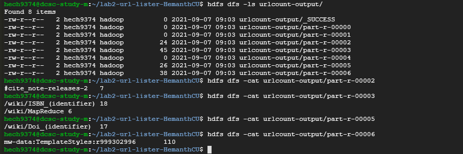

### Basic Summary:

URLCount program is based on the popular Map-Reduce example - WordCount, but instead of listing words and their counts, it lists the URLs and their counts for those URLs whose `count > 5`.

### Softwares used:

The program uses Java's Hadoop Map-Reduce libraries to set up the Map-Reduce model, and uses the regex Pattern and Matcher classes to extract the URLs from the lines of code read from the files as input.

### Resources used:

* https://hadoop.apache.org/docs/r3.0.3/hadoop-mapreduce-client/hadoop-mapreduce-client-core/MapReduceTutorial.html
* https://coding.csel.io
* https://www.vogella.com/tutorials/JavaRegularExpressions/article.html
* https://google.qwiklabs.com/focuses/586?parent=catalog
* Google Cloud Platform

### People who have assisted me in this assignment:

* Srinivas Akhil Mallela
* Aravind B Srinivas

### Updated files:

#### URLCount.java
* PatternMatcherMapper: Based off the mapper to WordCount, but does not Tokenize strings using StringTokenizer. Instead uses the entire line and regex Pattern Matcher classes to extract individual URLs and add them to <key,value> pairs
* IntSumCombiner: Identical to the reducer in WordCount.
* IntSumReducer: Almost identical to the Reducer in WordCount but performs the additional task of filtering out the URLs which do not satify the condition `count > 5`. Only outputs the keys and values where the value of count satifies the condition.

#### We cannot apply the `count > 5` condition at the combiner phase as it may discard results where counts in the individual mappers are <= 5 but the overall count may be > 5

#### Makefile
* Added commands to make the jar for URLCount into URLCount.jar
* Added commands to run the URLCount.jar and store the output in a local output folder when run on a local machine. In hdfs, we specify a different location in the dfs to store the output

### Output:
Listed is the output from the program run on a hadoop cluster:



Result aggregated from the different outputs of the reducers:

```
#cite_note-releases-2	7
/wiki/Doi_(identifier)	17
/wiki/ISBN_(identifier)	18
/wiki/MapReduce	6
mw-data:TemplateStyles:r999302996	110
```

### Running time:
#### 2 node:
* real    0m30.299s
* user    0m8.515s
* sys     0m0.485s

#### 4 node:
* real    0m27.734s
* user    0m8.562s
* sys     0m0.453s

While these are the recorded times on the final run of the code on the hadoop cluster for 2 and 4 node respectively, real times of the 2 node cluster ranged from 30s to 32s with 1 exceptionally slow run at 35s, and times of the 4 node cluster ranged from 27s to 30s.

From this, we show that though the 4 node cluster almost always performs better than the 2 node cluster, the performance gain is very marginal as the biggest performance bottleneck in our use case is the network itself. The time taken for processing all the URLs in the map, combine and reduce phases of the program is negligible compared to the time taken to shuffle those <key,value> pairs over the network.
